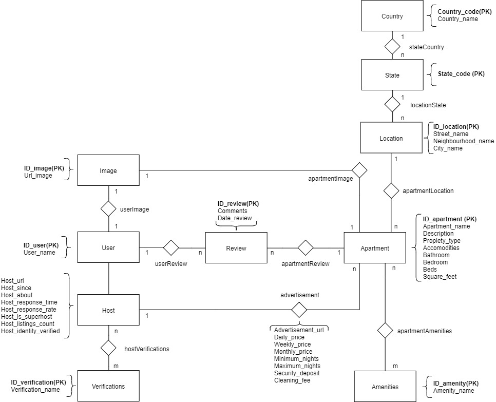
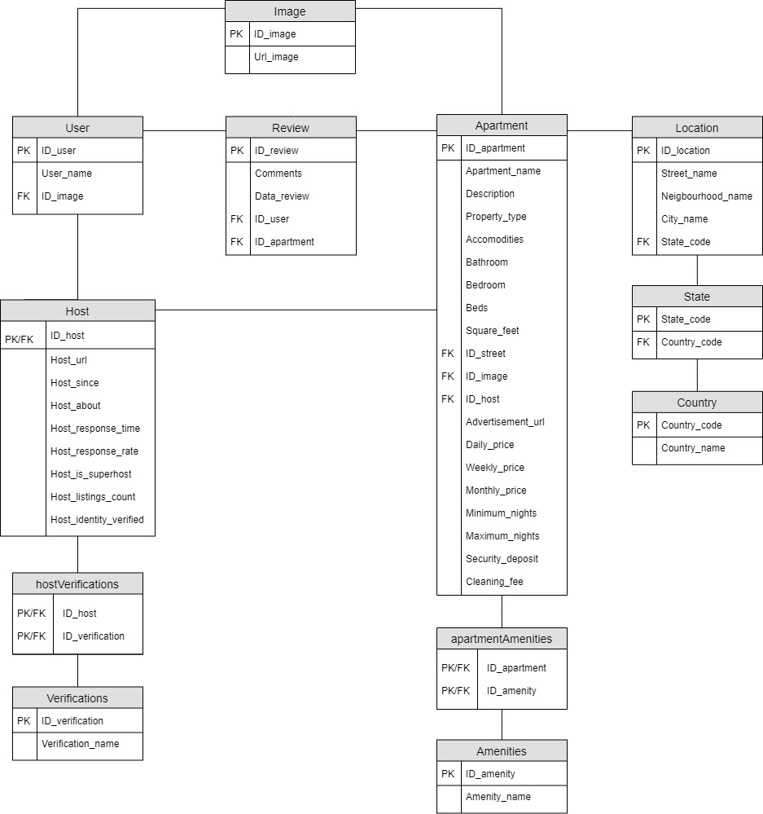

# LSEirbianbi
LSEibianbi is a practical database exercise divided in two phases.
In phase 1 we are given 3 large cvs files (Review.csv, Hosts.csv, Apartments.csv) and the objective is to organise the information to create a conceptual model, a relational model, a physical model and an import script. All models must be normalized, scalable and all table attributes must be justified.
In phase 2 the objective is to perform 10 varied queries to check that we have correctly imported all the data into the physical model, as well as to check that our approach to the conceptual and relational models is correct.
The dataset used to import the data can be found here https://drive.google.com/file/d/1FEgLPeYlNwaC3v848Ofhgk_Umk_haxni

## Conceptual Model

## Relational Model

## Queries
Queries can be found in the documentation Memoria.pdf

## Concepts developed in this project:
- Learn how to organise raw data to create and develop valid conceptual, relational and physical models.
- Use queries to be able to extract useful information from the physical model.
- Provide documentation tht describes in detail all models with justified tables and explanation and validation of all the queries made.

